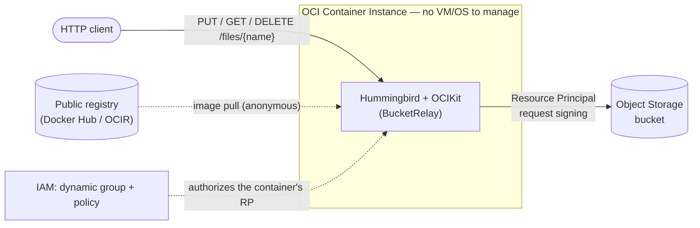

# BucketRelay

**BucketRelay** is a small [Hummingbird](https://github.com/hummingbird-project/hummingbird) REST
service, built on the [oci-swift-sdk](https://github.com/iliasaz/oci-swift-sdk) (`OCIKit`), that
uploads and downloads files to an OCI Object Storage bucket. It runs as an **OCI Container
Instance** and authenticates to OCI with **Resource Principals** — no API keys, no `~/.oci/config`,
no credentials baked into the image.

It's the server-side counterpart to the `FileLift`/`BucketView` desktop examples: same SDK, but
running *inside* OCI as a public HTTP API.

---

## What it demonstrates

- Packaging a server-side Swift app as a container image and deploying it with **zero server/OS
  management** via OCI Container Instances.
- Authenticating to OCI **from inside the container** using `ResourcePrincipalSigner` — the SDK
  reads the credentials OCI injects, so nothing secret ships in the image.
- The IAM you need to make that work: a **dynamic group** + a **policy**.
- Driving Object Storage (`putObject` / `getObject` / `listObjects` / `deleteObject`) through OCIKit.
- Managing the Container Instance itself **from Swift** — create, status, logs, delete — with
  `ContainerInstancesClient` (the `brctl` CLI), as an alternative to the `oci` CLI.

## Architecture



## Components & why

| Component | Role | Why it's nice |
|---|---|---|
| **OCI Container Instance** | Runs the container | Serverless containers — you hand OCI an image and a shape; there is **no VM, OS, patching, or orchestrator** to manage. Fast to start, billed per use. |
| **Resource Principal (RP)** | Auth from inside the container | The workload gets a short-lived identity automatically. **No API key or config file** in the image; OCIKit's `ResourcePrincipalSigner` reads what OCI injects and refreshes it. |
| **Object Storage bucket** | The files' backing store | Durable object store the service reads/writes via OCIKit. |
| **Container registry (public)** | Holds the image | A **public** repo lets the Container Instance pull anonymously — no image-pull secret to configure. (Private repos work too, with a pull secret.) |
| **Dynamic group + policy** | Authorization | The dynamic group *is* "container instances in this compartment"; the policy grants that group access to the bucket. This is what turns the RP identity into actual permissions. |

### Why Container Instances (vs. a VM or OKE)

You want to run one container that talks to OCI. With a VM you'd manage an OS, a container runtime,
and lifecycle. With OKE you'd run a Kubernetes cluster. A **Container Instance** is just: *"run this
image on this many OCPUs, give it a public IP."* Nothing to patch, nothing to keep alive.

## The REST API

| Method | Path | Description |
|---|---|---|
| `GET` | `/health` | Liveness (does not call OCI) |
| `GET` | `/` | Service info |
| `GET` | `/files` | List objects in the bucket (JSON) |
| `GET` | `/files/{name}` | Download an object |
| `PUT` | `/files/{name}` | Upload the request body as an object |
| `DELETE` | `/files/{name}` | Delete an object |

## How Resource Principal works here

When a Container Instance runs with a resource principal, OCI injects these into the container:

```
OCI_RESOURCE_PRINCIPAL_VERSION=2.2
OCI_RESOURCE_PRINCIPAL_RPST=/var/oci/rp-identity/latest/session_token   # a file path
OCI_RESOURCE_PRINCIPAL_PRIVATE_PEM=/var/oci/rp-identity/latest/private_key
OCI_RESOURCE_PRINCIPAL_REGION=us-phoenix-1
```

OCIKit turns that into a signer with one call, and you use it like any other:

```swift
let signer = try ResourcePrincipalSigner.fromEnvironment()   // reads the env above
let client = try ObjectStorageClient(region: region, signer: signer)
let data = try await client.getObject(namespaceName: ns, bucketName: bucket, objectName: name)
```

The signer signs each request with the injected session token (`ST$<rpst>`) and transparently
reloads it from disk before it expires. See `Sources/App/main.swift`.

Because of this, the **image only needs the bucket name** to be useful: the region comes from
`OCI_RESOURCE_PRINCIPAL_REGION`, and the namespace is auto-detected at runtime via `getNamespace()`
(authenticated with the resource principal). The published image hardcodes a default bucket of
`bucket-relay-bucket`; override it with the `OCI_BUCKET` env var.

---

## Run it

### Prerequisites
- OCI CLI configured (`~/.oci/config`) with permission to create networking, Object Storage, and
  IAM in your target compartment.
- Docker, logged into a registry you can push to (Docker Hub is easiest — a public repo needs no
  pull secret).
- Your tenancy **home region** (IAM writes must go there).

### 0. Configure
```bash
cd deploy
cp config.env.example config.env
# edit config.env: COMPARTMENT_ID, REGION, HOME_REGION, AVAILABILITY_DOMAIN, IMAGE, SHAPE
```

### 1. Provision OCI (network + bucket + IAM)
```bash
./1-provision.sh               # writes deploy/state.env with the subnet, namespace, etc.
```

### 2. (Optional) Build & push your own image
A ready-to-use **arm64** image is already published at `docker.io/iliasaz/bucket-relay:latest`
(the default `IMAGE` in `config.env.example`), so you can **skip this step** and go straight to
deploy. Build your own only if you changed the code or need an x86 (`E4.Flex`) image:
```bash
./2-build-and-push.sh          # builds for arm64 (A1) or amd64 (E4) to match $SHAPE
```
> On Docker Hub, make the repo **public** so the Container Instance can pull it anonymously.

### 3. Deploy the Container Instance
Deploy with the shell script (uses the `oci` CLI):
```bash
./3-deploy.sh                  # creates the instance, prints the public URL, smoke-tests it
```
…or with the Swift CLI (uses OCIKit's `ContainerInstancesClient`) — run from the `BucketRelay/`
directory after sourcing the config:
```bash
source deploy/config.env && source deploy/state.env
swift run brctl create         # creates + waits for ACTIVE, prints the instance OCID + endpoints
```

Either way, the service listens on **port 8080**:
```bash
curl http://<public-ip>:8080/health                                    # -> ok
curl http://<public-ip>:8080/files                                     # list objects (JSON)
curl -X PUT --data-binary "hello" http://<public-ip>:8080/files/note.txt   # upload
curl http://<public-ip>:8080/files/note.txt                            # download
curl -X DELETE http://<public-ip>:8080/files/note.txt                  # delete
```
(The `oci` CLI command to fetch the public IP is printed by both `3-deploy.sh` and `swift run brctl create`.)

### Tear down
```bash
./teardown.sh                  # removes the instance, IAM, bucket (+ all objects), and network
```

---

## Manage the instance from Swift (`brctl`)

`3-deploy.sh` creates the Container Instance with the `oci` CLI. This example also ships a small
Swift CLI — **`brctl`** — that does the same with OCIKit's `ContainerInstancesClient`, so you can
stay in Swift. Auth uses `~/.oci/config` (API key by default; set `OCI_CLI_AUTH=security_token` for
a session-token profile). Run it from the `BucketRelay/` directory:

```bash
source deploy/config.env && source deploy/state.env   # COMPARTMENT_ID, SUBNET_ID, IMAGE, AVAILABILITY_DOMAIN, ...

swift run brctl create                       # create + wait for ACTIVE, print the OCID + endpoints
swift run brctl list                         # list instances in the compartment (state / name / OCID)
swift run brctl get    <instance-ocid>       # full instance as JSON
swift run brctl status <instance-ocid>       # lifecycle state
swift run brctl logs   <instance-ocid>       # container logs (retrieveLogs)
swift run brctl delete <instance-ocid>       # delete
```

`create` reads the same values the deploy scripts use (from the environment) or via flags — see
`swift run brctl create --help`. It's a compact tour of `ContainerInstancesClient` in
[`Sources/brctl/BucketRelayCtl.swift`](Sources/brctl/BucketRelayCtl.swift):
`createContainerInstance`, `listContainerInstances`, `getContainerInstance`, `retrieveLogs`, and
`deleteContainerInstance`.

---

## Notes

- ⚠️ **The endpoint is public and unauthenticated**, and it can read/write your bucket via RP. That's
  fine for a demo — for anything real, put it behind auth / an API gateway, or restrict the `8080`
  ingress rule to your own IP. Tear it down when you're done.
- **Shape ↔ architecture must match:** `CI.Standard.A1.Flex` is Ampere (build `linux/arm64`);
  `CI.Standard.E4.Flex` is x86 (build `linux/amd64`). `2-build-and-push.sh` picks the platform from
  `$SHAPE` for you.
- **OCIKit dependency:** the example tracks `oci-swift-sdk` on `branch: "main"` (see `Package.swift`).
  Pin it to a tagged release for reproducible builds once one is published.
- **Resource Principals aren't Container-Instances-only** — the same `ResourcePrincipalSigner` works
  in OCI Functions and Data Science, anywhere OCI injects the `OCI_RESOURCE_PRINCIPAL_*` environment.
