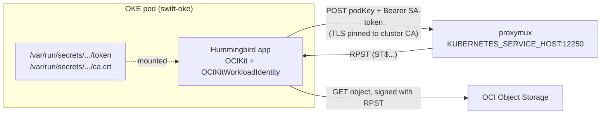
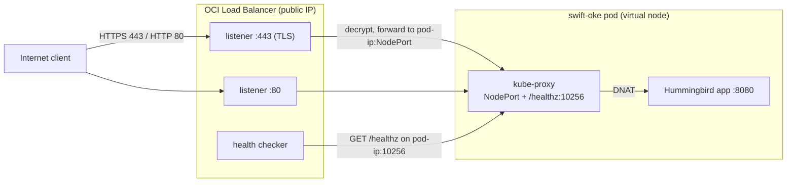
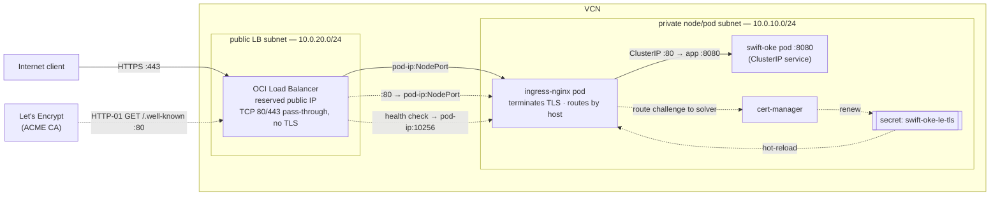
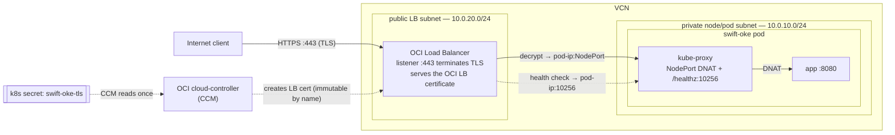

# swift-oke

A small [Hummingbird](https://github.com/hummingbird-project/hummingbird) REST service that reads a file from **OCI Object Storage** and returns its text — authenticating with **OKE Workload Identity**. It runs as a pod in an Oracle Container Engine for Kubernetes (OKE) cluster and uses **no API key and no config file**: the pod's Kubernetes service account *is* the identity, authorized by a condition-based OCI IAM policy. With two optional environment variables it also ships **its own logs and metrics** back to OCI, signed with that same identity.

## What it demonstrates

- **OKE Workload Identity** end-to-end with [`OCIKit`](https://github.com/iliasaz/oci-swift-sdk): `OKEWorkloadIdentitySigner.fromWorkloadIdentity()` exchanges the pod's projected service-account token for a resource principal session token (RPST) at the in-cluster *proxymux* endpoint, then signs Object Storage requests with it.
- **In-process custom-CA TLS**. The proxymux TLS certificate is signed by the in-cluster Kubernetes CA (not a public CA). The opt-in `OCIKitWorkloadIdentity` product pins that CA **in-process** via AsyncHTTPClient + NIOSSL (BoringSSL) — so there is **no `update-ca-certificates` step, no cluster CA install, nothing extra in the image**. It just reads the CA that Kubernetes already projects into every pod.
- **One RPST, three services.** The same signer backs OCIKit's two observability backends: `OCILogHandler` (a swift-log backend over `PutLogs` → **OCI Logging**) and `OCIMetricsFactory` (a swift-metrics backend over `PostMetricData` → **OCI Monitoring**). Application code writes plain `Logger` and `Counter`/`Timer` calls; only the bootstrap in `main.swift` knows about OCI. Both halves are **opt-in and fail-soft** — with their variables unset the service logs to stdout and records no metrics, and a telemetry failure never breaks `/health`.

## Architecture



## Authentication flow

1. `OKEWorkloadIdentitySigner.fromWorkloadIdentity()` reads `KUBERNETES_SERVICE_HOST` and the auto-mounted service-account token + cluster CA.
2. It generates an ephemeral RSA key and `POST`s the public key (`podKey`) to `https://$KUBERNETES_SERVICE_HOST:12250/resourcePrincipalSessionTokens`, authenticated with the SA bearer token, **verifying the proxymux TLS cert against the cluster CA in-process**.
3. The proxymux returns an RPST; the signer signs OCI requests with `keyId = ST$<rpst>` and the ephemeral key, refreshing at the token's half-life.

```swift
import OCIKit
import OCIKitWorkloadIdentity

let signer = try await OKEWorkloadIdentitySigner.fromWorkloadIdentity()
let client = try ObjectStorageClient(region: region, signer: signer)
let data = try await client.getObject(
  namespaceName: ns, bucketName: "bucket-relay-bucket", objectName: "swift-oke-test.txt")
```

## REST API

| Method | Path            | Description                                                       |
| ------ | --------------- | ----------------------------------------------------------------- |
| GET    | `/health`       | Liveness (no OCI call).                                           |
| GET    | `/`             | Service info.                                                     |
| GET    | `/file`         | Read `OCI_OBJECT` (default `swift-oke-test.txt`).                 |
| GET    | `/files/{name}` | Read any object in the bucket, returned as text.                  |
| GET    | `/telemetry`    | Log/metric delivery counters — see *Observability* below.         |

## Configuration

All environment variables are optional; an empty value counts as unset.

| Variable                | Default                       | Purpose                                                                                        |
| ----------------------- | ----------------------------- | ---------------------------------------------------------------------------------------------- |
| `OCI_BUCKET`            | `bucket-relay-bucket`         | Bucket to read from.                                                                            |
| `OCI_OBJECT`            | `swift-oke-test.txt`          | Object `/file` returns.                                                                         |
| `OCI_REGION`            | `OCI_RESOURCE_PRINCIPAL_REGION` | Region id, e.g. `us-phoenix-1`.                                                               |
| `OCI_NAMESPACE`         | auto-detected                 | Object Storage namespace; setting it skips the `getNamespace()` call.                           |
| `PORT`                  | `8080`                        | Listen port.                                                                                    |
| `LOG_LEVEL`             | `info`                        | swift-log level, for both the console handler and the OCI one.                                  |
| `OCI_LOG_ID`            | *(unset — logs stay local)*   | OCID of a custom log in OCI Logging. Set it to ship logs via `PutLogs`.                         |
| `OCI_METRICS_NAMESPACE` | *(unset — metrics no-op)*     | Metric namespace, e.g. `swift_oke`. Must match `[a-z][a-z0-9_]*[a-z0-9]`, no `oci_`/`oracle_`.  |
| `OCI_COMPARTMENT_ID`    | *(unset — metrics no-op)*     | Compartment the metric data is posted into. Required **together with** `OCI_METRICS_NAMESPACE`. |
| `POD_NAME`              | `HOSTNAME`, then the OS hostname | Identifies the emitter: the log `source` field and the `pod` metric dimension. The manifest injects it from the downward API — see the gotcha below. |

> ⚠️ **Don't trust `HOSTNAME` for the pod name on virtual nodes.** The reflex is to read `HOSTNAME` (or `ProcessInfo.processInfo.hostName`) and call it the pod name. On this cluster's virtual nodes both return **`localhost`** — verified by reading the `source` field back out of OCI Logging. Nothing errors: every replica just reports the same name, and the label you added specifically to tell replicas apart quietly becomes a constant. The manifest therefore injects the real name through the downward API, which is authoritative on every node type:
>
> ```yaml
> - name: POD_NAME
>   valueFrom:
>     fieldRef:
>       fieldPath: metadata.name
> ```

## Observability (optional)

Set `OCI_LOG_ID` and/or the `OCI_METRICS_NAMESPACE` + `OCI_COMPARTMENT_ID` pair and the pod ships its own telemetry to OCI over the workload identity it already holds — no second credential:

- **Logs.** `LoggingSystem.bootstrap` installs a `MultiplexLogHandler` of the console handler (so `kubectl logs` keeps showing everything) and `OCILogHandler`, which batches records and flushes every 5s.
- **Metrics.** `MetricsSystem.bootstrap(OCIMetricsFactory(...))`, plus a small middleware recording `http_requests_total` (counter) and `http_request_duration` (timer) per request, dimensioned by route *template*, an allow-listed HTTP method, and status *class* — deliberately bounded, since each distinct combination mints its own metric stream. The factory stamps `app` and `pod` onto every stream.
- **A domain metric.** `bytes_served_total` (counter) adds up the payload bytes actually read out of Object Storage, dimensioned by `bucket` alone. It is incremented in the store's read path rather than in the middleware, because that is the only place the byte count exists — upstack the middleware holds a `Response` whose body is a stream it must not consume. The object *name* is deliberately **not** a dimension: it is the caller's to choose, so labelling by it would mint one metric stream per distinct URL ever requested.
- **Shutdown.** A `ServiceLifecycle` service drains both buffers on SIGTERM, after the HTTP server has stopped. `deploy/swift-oke.yaml` raises `terminationGracePeriodSeconds` to 45 to cover it.

> **A counter is exported as the per-step delta, not a running total.** Ask for the cumulative figure in the query — `bytes_served_total[1m].sum()` summed over your window — rather than expecting a monotonic number from the metric itself. That is the shape you want across restarts: an in-process running total would reset to zero on every rollout and read as a cliff. It also means an idle step posts nothing at all instead of a flat line of zeroes.

Neither backend ever reports a delivery failure by throwing — a wrong log OCID or a missing policy statement looks exactly like a healthy pod. `GET /telemetry` is how you find out:

```
$ curl https://$HOST/telemetry
logging: enabled
metrics: enabled (namespace=swift_oke)
log.enqueued = 128
log.submitted = 128
log.flushFailures = 0
log.lastFlushError = none
metrics.postedStreams = 6
...
```

`logging: failed` (as opposed to `disabled`) means the startup bootstrap did not complete. It is a **one-shot** and is never retried — restart the pod, and read `kubectl logs` for the reason. The endpoint reports only the *case name* of a flush error, since it is served unauthenticated on the same public listener; the full text (which includes the service's raw response body) stays in `kubectl logs`. Put it behind auth or a separate listener before exposing anything richer.

### Verifying delivery independently

`GET /telemetry` proves the app *thinks* it delivered — it's the app's own counters. To confirm OCI actually received the data, query the two services directly with the OCI CLI. Below is real output (OCIDs and tenancy-specific identifiers redacted) from a run against a live OKE pod, curled with a unique marker string so the entries are unambiguous:

**Logs** — `oci logging-search search-logs`, targeting `<compartment_ocid>/<loggroup_ocid>/<log_ocid>`:

```bash
oci logging-search search-logs --profile <profile> --search-query \
  "search \"<compartment_ocid>/<loggroup_ocid>/<log_ocid>\" | sort by datetime desc" \
  --time-start 2026-07-22T03:44:00.000Z --time-end 2026-07-22T03:47:30.000Z --limit 50
```

Real result: **103 entries** in the window, all carrying `oracle.{compartmentid,loggroupid,logid,tenantid}` matching the target log exactly (no cross-contamination). 42 of the 103 contained the curled marker string, and that count decomposed exactly against the traffic driven (10 marked root-path hits × 1 line each, plus 8 marked 404s × 4 lines each — request, `ObjectStorageClient` `ObjectNotFound`, `swift-oke.store` "object read failed", `swift-oke` "request failed"). One full entry, verbatim, showing the structured fields survive the round trip:

```json
{
  "data": {
    "datetime": 1784691950321,
    "logContent": {
      "data": {
        "message": "2026-07-22T03:45:50.321Z error swift-oke : error=unexpectedStatusCode(404, \"The object 'does-not-exist-obs-probe-<marker>-8.txt' was not found in the bucket 'bucket-relay-bucket'\") hb.request.id=6641d0b5061e3fea59c775f3437876e1 object=does-not-exist-obs-probe-<marker>-8.txt [App] request failed"
      },
      "id": "740A3932-4522-471C-AE0F-C152735DA4EA",
      "oracle": {
        "compartmentid": "<compartment_ocid>",
        "ingestedtime": "2026-07-22T03:45:52.992651747Z",
        "loggroupid": "<loggroup_ocid>",
        "logid": "<log_ocid>",
        "tenantid": "<tenancy_ocid>"
      },
      "source": "localhost",
      "specversion": "1.0",
      "subject": "swift-oke",
      "time": "2026-07-22T03:45:50.321Z",
      "type": "com.oracle.oci-swift-sdk.swift-oke"
    }
  }
}
```

Three distinct swift-log logger labels reached OCI Logging (`swift-oke`, `swift-oke.store`, `ObjectStorageClient`), and both `info`/`error` levels appear — nothing is collapsed or dropped between the handler and `PutLogs`. Ingestion lag (`oracle.ingestedtime` − `logContent.time`) ran 0.76s–4.25s, ordinary pipeline latency.

**Metrics** — `oci monitoring metric list` to see the streams that exist, then `summarize-metrics-data` to pull datapoints:

```bash
oci monitoring metric list --profile <profile> --compartment-id <compartment_ocid> --namespace swift_oke --all

oci monitoring metric-data summarize-metrics-data --profile <profile> \
  --compartment-id <compartment_ocid> --namespace swift_oke \
  --query-text 'http_requests_total[1m].sum()' \
  --start-time 2026-07-22T03:40:00Z --end-time 2026-07-22T03:52:19Z
```

Real result: exactly **10 streams** — `{http_requests_total, http_request_duration}` × 5 routes (`/`, `/file`, `/files/{name}`, `/health`, `/telemetry`), each dimensioned `{app, method, pod, route, status_class}` — confirming the route-template cardinality guard works (`/files/{name}` stayed one stream, never one per filename curled). `http_requests_total[1m].sum()` in the probe's 1-minute bucket: `route=/` → 10, `route=/file` → 10, `route=/files/{name}` (`status_class=4xx`) → 8, `route=/telemetry` → 1 — an exact match for the traffic driven. `http_request_duration[1m].sum()` (unit `ns`, from the response's `metadata.unit`) in the same bucket: `/file` ≈ 30.1ms avg over 10 requests, `/files/{name}` 4xx ≈ 13.0ms avg over 8, `/` ≈ 22.4µs avg, `/telemetry` ≈ 42.5µs for its one request — both a counter and a timer present for every recorded route, values non-zero and magnitude-plausible for what each route does.

`bytes_served_total` was checked the same way, against a known quantity — 10 requests for a 36-byte object, plus 10 requests for objects that do not exist:

```bash
oci monitoring metric-data summarize-metrics-data --profile <profile> \
  --compartment-id <compartment_ocid> --namespace swift_oke \
  --query-text 'bytes_served_total[1m].sum()' \
  --start-time 2026-07-22T05:51:00Z --end-time 2026-07-22T05:56:00Z
```

Real result: a single datapoint of **360 B** — exactly 10 × 36, with the ten 404s contributing nothing, confirming the counter sits on the success path only.

> ⚠️ **Don't measure across a rollout.** An earlier run of this same check came back 396 B against an expected 576 B. The counter was right; the *test* was wrong. `kubectl rollout status` had already returned success while the old pod was still draining behind the ingress, so it served 5 of the 16 requests — on the previous image, which had no `bytes_served_total` at all. The per-pod split in `http_requests_total` (5 on the old pod, 11 on the new, 16 total) is what pinned it down. Wait until `kubectl get pods -l app=swift-oke` shows exactly one pod before driving verification traffic, and treat the `pod` dimension as load-bearing when a number does not reconcile.

Allow 1-2 minutes after traffic for both services to index before querying — see the `PutLogs`/`PostMetricData` propagation note above.

## Prerequisites (OCI side, one-time)

1. **Enhanced OKE cluster.** Workload identity requires an enhanced cluster (a non-enhanced cluster returns HTTP 403 "please ensure the cluster type is enhanced").
2. **A bucket + the test object.** In `bucket-relay-bucket`, upload an object named `swift-oke-test.txt` with some text (e.g. `Hello from OKE Workload Identity!`).
3. **An IAM policy** authorizing the workload. OKE Workload Identity does **not** use dynamic groups — you grant access with a **condition-based `any-user` policy** that matches the pod's `request.principal.*` attributes ([Oracle docs](https://docs.oracle.com/en-us/iaas/Content/ContEng/Tasks/contenggrantingworkloadaccesstoresources.htm)). Create it with the OCI CLI (replace the `<...>` placeholders — `BUCKET_COMPARTMENT` is the compartment holding the bucket, `CLUSTER_OCID` your cluster's OCID):

   ```bash
   oci iam policy create \
     --compartment-id <BUCKET_COMPARTMENT_OCID> \
     --name swift-oke-policy \
     --description "Allow the swift-oke workload to read bucket-relay-bucket" \
     --statements '[
       "Allow any-user to read objects in compartment id <BUCKET_COMPARTMENT_OCID> where all {request.principal.type = '\''workload'\'', request.principal.namespace = '\''default'\'', request.principal.service_account = '\''swift-oke'\'', request.principal.cluster_id = '\''<CLUSTER_OCID>'\'', target.bucket.name = '\''bucket-relay-bucket'\''}",
       "Allow any-user to read buckets in compartment id <BUCKET_COMPARTMENT_OCID> where all {request.principal.type = '\''workload'\'', request.principal.namespace = '\''default'\'', request.principal.service_account = '\''swift-oke'\'', request.principal.cluster_id = '\''<CLUSTER_OCID>'\''}"
     ]'
   ```

   Handy lookups: the bucket's compartment — `oci os bucket get --name bucket-relay-bucket --namespace <ns>` (or Console); your cluster's OCID — `oci ce cluster list --compartment-id <c>`.

> The condition attributes (`namespace`, `service_account`, `cluster_id`) must match the pod: namespace `default`, service account `swift-oke`, and your cluster's OCID.

4. **Only if you want telemetry** (`OCI_LOG_ID` / `OCI_METRICS_NAMESPACE`): a **custom log** in OCI Logging (Console: *Logging → Log groups → Create log*; note its OCID), and **two more statements** in the same policy, in the same condition form — `use log-content` for `PutLogs` and `use metrics` for `PostMetricData`. `oci iam policy update` **replaces** the statement list rather than appending to it, so pass the existing statements too:

   ```bash
   oci iam policy update --policy-id <POLICY_OCID> --version-date "" --force --statements '[
     "<... the two Object Storage statements from step 3 ...>",
     "Allow any-user to use log-content in compartment id <COMPARTMENT_OCID> where all {request.principal.type = '\''workload'\'', request.principal.namespace = '\''default'\'', request.principal.service_account = '\''swift-oke'\'', request.principal.cluster_id = '\''<CLUSTER_OCID>'\''}",
     "Allow any-user to use metrics in compartment id <COMPARTMENT_OCID> where all {request.principal.type = '\''workload'\'', request.principal.namespace = '\''default'\'', request.principal.service_account = '\''swift-oke'\'', request.principal.cluster_id = '\''<CLUSTER_OCID>'\''}"
   ]'
   ```

   > ⚠️ **IAM policy changes take up to ~15 minutes to take effect.** Until they do, `PutLogs` and `PostMetricData` are rejected — and the log path swallows that failure by design (reporting it through swift-log would recurse). Check `GET /telemetry` for `log.flushFailures` / `log.lastFlushError` before concluding anything is wrong with the code.

## Build & push the image

> **Skip this section if you just want to run the example** — ready-made linux/arm64 images (matching OKE virtual nodes' Arm pods) are published at [`docker.io/iliasaz/swift-oke`](https://hub.docker.com/r/iliasaz/swift-oke): `:observability` is this version, with the OCI Logging + Monitoring wiring, and is what `deploy/swift-oke.yaml` pins; `:latest` is the plain workload-identity demo without it. Build your own if you're on amd64 nodes or changing the code — and remember to point the manifest's `image:` at your build, or you will be running the published one.

The `Dockerfile` builds from the SDK as a **remote** dependency, so the container build can fetch it. The checked-in `Package.swift` tracks `main`, and must keep pointing at *some* remote ref, because the sibling SDK checkout is not in the image build context:

```swift
// Package.swift
.package(url: "https://github.com/iliasaz/oci-swift-sdk.git", branch: "main"),
// → pin to a tagged release instead if you want reproducible image builds.
```

Then build for your node-pool architecture and push to OCIR:

```bash
cd swift-oke
REGISTRY=<region-key>.ocir.io/<tenancy-namespace>   # e.g. fra.ocir.io/mytenancynamespace
docker build --platform linux/arm64 -t "$REGISTRY/swift-oke:latest" .   # or linux/amd64
docker login <region-key>.ocir.io                                       # user: <tenancy-namespace>/<user>, pass: auth token
docker push "$REGISTRY/swift-oke:latest"
```

## Deploy

Edit `deploy/swift-oke.yaml` and replace every `<PLACEHOLDER>`:

| Field                   | Set it to                                                                                       |
| ----------------------- | ------------------------------------------------------------------------------------------------ |
| `image`                 | Your own build, if you made one. The checked-in default is `docker.io/iliasaz/swift-oke:observability`. |
| `OCI_REGION`            | Your region id, e.g. `us-phoenix-1`.                                                             |
| `OCI_NAMESPACE`         | Your Object Storage namespace (`oci os ns get`), or delete the variable to auto-detect it.        |
| `OCI_BUCKET` / `OCI_OBJECT` | Only if your bucket or object differ from the demo defaults.                                  |
| `OCI_LOG_ID`            | Your custom log's OCID — **or leave it empty** to run without OCI Logging.                        |
| `OCI_COMPARTMENT_ID`    | The compartment to post metrics into — **or leave it empty** to run without OCI Monitoring.       |

The two telemetry OCIDs ship empty rather than as `<placeholders>` on purpose: empty means "that backend is off", which is a working deployment, whereas a leftover placeholder would build a client against an OCID you do not own and then fail *silently* at flush time.

The bundled Service is a **public OCI Load Balancer** tuned for a virtual-nodes cluster — this is **Option B** in the next section, and it needs the LB subnet security rules (and a TLS secret) before it serves cleanly. If you plan to use **Option A** (a real Let's Encrypt cert via ingress-nginx, recommended), or just want an internal-only test, swap this Service for the minimal `ClusterIP` variant shown in the manifest and reach the app in-cluster instead. Either way, read *Expose it publicly* next before wiring up TLS.

```bash
kubectl apply -f deploy/swift-oke.yaml
kubectl rollout status deploy/swift-oke
```

> The irony isn't lost on us: this example is nominally about **Workload Identity** — running a Swift container on OKE and letting it reach other OCI services with no keys and no config — yet most of this page is about coaxing OKE's networking into letting anyone *reach* the container in the first place. That ratio is a faithful reflection of the lived experience.

## Expose it publicly (HTTPS)

Two ways to get a public HTTPS URL, both fronted by a **flexible OCI Load Balancer** with its own public IP (distinct from the cluster's API-server endpoint on `:6443`, which never routes to your workloads):

- **Option A (recommended): a real Let's Encrypt certificate** via ingress-nginx + cert-manager. TLS terminates inside the cluster, and certificates **auto-renew** with no manual steps and no `-k`. The OCI LB only passes TCP through, so nothing terminates TLS on OCI — which sidesteps the immutable-LB-certificate problem of the other option.
- **Option B: TLS terminated at the OCI Load Balancer** itself. No extra components, but you manage the certificate yourself — self-signed, or a real one you rotate by hand.

Either way the same virtual-nodes pieces sit underneath, so the next three sections — **how load balancing works**, **security rules**, and **routing** — apply to both. Read those first, then jump to Option A or Option B.

### How load balancing actually works on virtual nodes

Every virtual node carries the label `node.kubernetes.io/exclude-from-external-load-balancers: "true"`, so OKE never registers nodes as LB backends. Instead the **pods are the backends**, reached as `<pod-ip>:<NodePort>` — not `<pod-ip>:<targetPort>`. This works because **each pod on a virtual node runs its own kube-proxy** (inside the pod, not in `kube-system`): it serves the NodePort DNAT to the app on 8080, and the LB health check `HTTP GET /healthz` on port **10256**, both on the pod's own IP.

Because the node-registration path is disabled, the Service permanently emits `Warning ... UnAvailableLoadBalancer — There are no available nodes for LoadBalancer` events. On virtual nodes these are **cosmetic and expected** — the pod-backend path is what actually serves traffic.

Two things that look configurable here are not:

- **Pod backends need no annotation** — they are the built-in (and only) behavior on virtual nodes. The `oci.oraclecloud.com/oci-load-balancer-backend-policy: "pods"` annotation that circulates in forum posts appears in no OCI documentation, and we verified the backend registration is byte-for-byte identical with and without it.
- **Don't confuse this with OKE's documented ["pods as backends" feature](https://docs.oracle.com/en-us/iaas/Content/ContEng/Tasks/contengconfiguringloadbalancersnetworkloadbalancers-subtopic.htm)** (`oci-load-balancer.oraclecloud.com/backend-type: "pod"` + `allocateLoadBalancerNodePorts: false`), which targets `pod-ip:targetPort` with a custom app health check. That feature is **managed-nodes-only** ("supported on managed nodes, but not on virtual nodes") — on virtual nodes you get the `<pod-ip>:<NodePort>` + `/healthz:10256` model described above, and it works fine.



> `externalTrafficPolicy: Local` (client-IP preservation) is **not supported** on virtual nodes — keep the default `Cluster`.

Option A works the same way, one layer out: the OCI LB's backends are then the **ingress-nginx** pods (still `<pod-ip>:<NodePort>` with `/healthz:10256`), and nginx routes to the swift-oke ClusterIP Service inside the cluster.

### Security rules

OKE **never** manages LB security rules on virtual nodes (management mode is effectively `None`), so you create them yourself. The LB subnet must allow the listeners in and the traffic + health check out to the node/pod subnet; the node/pod subnet must allow that traffic + health check in:

| Seclist | Direction | Endpoint | Protocol / ports | Purpose |
| --- | --- | --- | --- | --- |
| LB subnet `10.0.20.0/24` | ingress | `0.0.0.0/0` | TCP 80 | HTTP listener |
| LB subnet `10.0.20.0/24` | ingress | `0.0.0.0/0` | TCP 443 | HTTPS listener |
| LB subnet `10.0.20.0/24` | egress | node CIDR `10.0.10.0/24` | TCP 30000-32767 | traffic to pod NodePorts |
| LB subnet `10.0.20.0/24` | egress | node CIDR `10.0.10.0/24` | TCP 10256 | **health check** to pods |
| node subnet `10.0.10.0/24` | ingress | LB CIDR `10.0.20.0/24` | TCP 30000-32767 | traffic from LB |
| node subnet `10.0.10.0/24` | ingress | LB CIDR `10.0.20.0/24` | TCP 10256 | health check from LB |

The CIDRs above are the Quick-Create wizard's defaults (LB subnet `oke-svclbsubnet-*` = `10.0.20.0/24`, node/pod subnet `oke-nodesubnet-*` = `10.0.10.0/24`). The script discovers those subnets by name and ensures all six rules idempotently — safe to re-run:

```bash
./deploy/lb-security-rules.sh <compartment-ocid> --profile <profile>
```

> ⚠️ **The gotcha that bites everyone:** the health-check **egress** rule must target the **node/pod** subnet, not the LB subnet. A wrong destination here is **invisible in the Service events** — the LB comes up, serves traffic for ~30 seconds after each reconcile, then the OCI health checker (blocked from reaching `:10256`) marks the backends unhealthy and the LB stops forwarding. "Works, then dies" almost always means this rule.

### Routing (verify only)

The Quick Create wizard also sets up the route tables correctly, so this is a **verify-only** step — only hand-built VCNs need to create these. Confirm with `oci network route-table list --compartment-id <compartment> --vcn-id <vcn-ocid>`:

| Subnet | Route table | Rule | Purpose |
| --- | --- | --- | --- |
| LB subnet `10.0.20.0/24` (public) | `oke-public-routetable-*` | `0.0.0.0/0` → Internet Gateway | makes the LB internet-reachable |
| node/pod subnet `10.0.10.0/24` (private) | `oke-private-routetable-*` | `0.0.0.0/0` → NAT Gateway | pods reach the internet (e.g. to pull images) |
| node/pod subnet `10.0.10.0/24` (private) | `oke-private-routetable-*` | `all-<region>-services-in-oracle-services-network` → Service Gateway | pods reach OCI services (proxymux, Object Storage) for workload identity |

The pod subnet must route out through the **NAT gateway** (not an internet gateway) plus the **service gateway**, per the [virtual-nodes network docs](https://docs.oracle.com/en-us/iaas/Content/ContEng/Tasks/contengnetworkconfig-virtualnodes.htm).

### Option A (recommended): a real certificate with ingress-nginx + cert-manager + Let's Encrypt

TLS terminates inside the cluster at **ingress-nginx**, and **cert-manager** obtains and auto-renews a real **Let's Encrypt** certificate over HTTP-01. The OCI LB fronting the ingress-nginx Service only passes TCP 80/443 through, so **nothing terminates TLS on OCI** — and the immutable-LB-certificate gotcha simply doesn't exist here.

Here's the whole path (the shared diagram earlier zooms into the kube-proxy/NodePort detail on one pod; this one is the map):



Solid arrows are request traffic; dashed arrows are the certificate machinery and health checks. Routing (see *Routing* above): the LB subnet reaches the internet via an Internet Gateway, the pod subnet egresses via NAT + Service gateways.

**1. Reserve a public IP** so the address — and the DNS name and certificates bound to it — survive Service/LB recreation:

```bash
oci network public-ip create --compartment-id <compartment> \
  --lifetime RESERVED --display-name swift-oke-ingress-ip --profile <profile>
# note the assigned "ip-address", e.g. 137.131.40.124 (free while it stays assigned)
```

**2. Install ingress-nginx, patched for virtual nodes _before_ it creates its LB.** Applying the manifest unpatched provisions a throwaway LB with an ephemeral IP and the unsupported `Local` policy, which then has to be recreated — so edit first, apply second:

```bash
curl -sL https://raw.githubusercontent.com/kubernetes/ingress-nginx/controller-v1.15.1/deploy/static/provider/cloud/deploy.yaml \
  -o ingress-nginx.yaml
```

In `ingress-nginx.yaml`, find the one `Service` named `ingress-nginx-controller` and set these fields on it:

```yaml
metadata:
  annotations:
    service.beta.kubernetes.io/oci-load-balancer-security-list-management-mode: "None"
    service.beta.kubernetes.io/oci-load-balancer-shape: "flexible"
    service.beta.kubernetes.io/oci-load-balancer-shape-flex-min: "10"
    service.beta.kubernetes.io/oci-load-balancer-shape-flex-max: "100"
spec:
  loadBalancerIP: <reserved-ip>          # from step 1 — pins the LB to the reserved IP
  externalTrafficPolicy: Cluster          # manifest ships "Local", which is unsupported on virtual nodes
```

Then apply and wait for the LB to take the reserved IP:

```bash
kubectl apply -f ingress-nginx.yaml
kubectl -n ingress-nginx get svc ingress-nginx-controller -w   # EXTERNAL-IP -> <reserved-ip>
```

**3. Ensure the security rules.** They're subnet-scoped, so the same six rules from Option B's script already cover the ingress LB — run it if you haven't:

```bash
./deploy/lb-security-rules.sh <compartment-ocid> --profile <profile>
```

**4. Install cert-manager:**

```bash
kubectl apply -f https://github.com/cert-manager/cert-manager/releases/download/v1.21.0/cert-manager.yaml
kubectl -n cert-manager rollout status deploy/cert-manager-webhook
```

ingress-nginx and cert-manager run as ordinary pods on virtual nodes; their images are multi-arch, so arm64 nodes are fine.

**5. Point the swift-oke Service at ClusterIP.** Option A fronts the app with the Ingress, so swift-oke needs only the in-cluster `ClusterIP` Service (the commented variant in `deploy/swift-oke.yaml`, port 80 → 8080), not the LoadBalancer one. If you previously applied the LB Service, switching it to ClusterIP deletes that direct LB automatically — leaving exactly one LB, the ingress one.

**6. Issue the certificate.** Fill `<ACME_EMAIL>` and `<INGRESS_HOST>` in `deploy/ingress-letsencrypt.yaml`, then apply:

```bash
kubectl apply -f deploy/ingress-letsencrypt.yaml
```

For `<INGRESS_HOST>`, [sslip.io](https://sslip.io) gives zero-setup DNS — `swift-oke.<reserved-ip-with-dashes>.sslip.io` resolves straight to the reserved IP (e.g. `swift-oke.137-131-40-124.sslip.io`), so no domain ownership is needed. For your own domain, set the host to it and point an A record at the reserved IP.

**7. Verify** — a real, fully verified certificate (note: no `-k`):

```bash
HOST=swift-oke.137-131-40-124.sslip.io
kubectl get certificate swift-oke-le-tls -w    # wait for READY=True (~1-2 min the first time)
curl    https://$HOST/health                   # -> ok  (full chain verified)
curl    https://$HOST/file                      # -> object text, read via workload identity
curl -I http://$HOST/                           # -> 308 redirect to https (nginx does this automatically)
```

cert-manager renews `swift-oke-le-tls` well before expiry and nginx hot-reloads it — there is no LB certificate to rotate, so the Option B immutable-cert dance never applies.

#### Why not terminate TLS at the OCI Load Balancer?

The OCI LB *can* terminate TLS — that's exactly what Option B does. The hard part is getting a **Let's Encrypt** certificate into it and keeping it there: LE certs expire after 90 days and want renewing about every 60, so "set it once" isn't an option. Three things make LB termination the wrong default here:

1. **The immutable-certificate behavior fights cert-manager.** As Option B describes, the CCM names the LB certificate after the Kubernetes secret and LB certs are **immutable by name** — but cert-manager's entire model is "renew the same secret in place." Point it at the LB and it would dutifully rewrite a secret the LB never re-reads, leaving the listener serving the *expired* cert. Automating it means building bespoke rename-and-reannotate glue whose failure mode is "site down with an expired cert two months from now." With nginx, the LB never sees the cert: cert-manager renews the secret and nginx hot-reloads it.
2. **sslip.io forces HTTP-01, and HTTP-01 needs path routing.** With no domain of your own, DNS-01 is off the table — sslip.io is a static resolver with no TXT records and no zone you control. That leaves HTTP-01, which serves a token at `http://<host>/.well-known/acme-challenge/…`. But with the plain LB Service, port 80 goes straight to the Swift app, so *something* has to route `/.well-known` to a challenge solver — and that something is an ingress controller (cert-manager's HTTP-01 solver is built to inject routes into one). No domain → sslip.io → HTTP-01 only → you need an ingress anyway.
3. **OCI has no managed public-certificate service.** AWS has ACM and GCP has managed certs that issue and self-renew right on the load balancer; OCI Certificates only issues from *your own private CA* (not browser-trusted), and public certs must be imported by hand with no ACME integration. If OCI had an ACM equivalent, terminating at the LB would be the obvious call.

What you trade: two extra in-cluster components (ingress-nginx, cert-manager) and one extra proxy hop. What you get: hands-off cert automation, an automatic HTTP→HTTPS redirect, and one LB that can front many services. The cost is identical — still exactly one load balancer.

> **With a real domain in a DNS zone you control** (e.g. OCI DNS), DNS-01 becomes available and argument #2 disappears — LE-at-the-LB is then genuinely *feasible*. But you'd still be writing the renewal glue for #1, which is why the boring cert-manager + ingress stack stays the default recommendation.

### Option B: TLS terminated at the OCI Load Balancer

No ingress controller or cert-manager: the OCI LB terminates TLS directly using a Kubernetes TLS secret, and you own the certificate lifecycle. Apply the LoadBalancer Service in `deploy/swift-oke.yaml` (its default) and give it a cert.



Here TLS terminates at the LB, so the certificate is an **OCI LB certificate** the CCM mints from the `swift-oke-tls` secret — which is why replacing it means the rename-and-reannotate dance below.

#### TLS secret

The Service terminates TLS at the LB using a Kubernetes TLS secret named `swift-oke-tls`. For a quick start, self-sign a cert:

```bash
openssl req -x509 -newkey rsa:2048 -keyout tls.key -out tls.crt -days 365 -nodes \
  -subj "/CN=swift-oke" -addext "subjectAltName=DNS:swift-oke"
kubectl create secret tls swift-oke-tls --cert=tls.crt --key=tls.key
```

A self-signed cert means clients must use `curl -k` (or trust the cert).

**Rotating or replacing the certificate — the secret name must change.** The cloud-controller creates the OCI LB certificate *named after the secret*, and LB certificates are **immutable by name**: updating the secret's contents in place never changes what the LB serves. To rotate (e.g. to add the LB's public IP to the SAN once you know it, or to swap in a real CA-issued cert for a DNS name pointing at the LB), create a **new** secret and repoint the annotation — the listener switches with no downtime:

```bash
openssl req -x509 -newkey rsa:2048 -keyout tls.key -out tls.crt -days 365 -nodes \
  -subj "/CN=swift-oke" -addext "subjectAltName=IP:<LB_PUBLIC_IP>,DNS:swift-oke"
kubectl create secret tls swift-oke-tls-2 --cert=tls.crt --key=tls.key
kubectl annotate svc swift-oke \
  service.beta.kubernetes.io/oci-load-balancer-tls-secret=swift-oke-tls-2 --overwrite
```

#### Deploy and verify

```bash
kubectl apply -f deploy/swift-oke.yaml
kubectl get svc swift-oke -w        # wait for EXTERNAL-IP to leave <pending>
```

Once an EXTERNAL-IP is assigned:

```bash
LB=<external-ip>
curl    http://$LB/health                    # -> ok
curl -k https://$LB/health                    # -> ok
curl -k https://$LB/file                       # -> text of swift-oke-test.txt (Object Storage via workload identity)
curl -k https://$LB/files/some-other-object.txt
```

If `/file` returns the file's text, the pod authenticated to Object Storage purely through its Kubernetes identity — no keys, no config.

Confirm the OCI side is healthy. Backends should be registered as `<pod-ip>:<NodePort>` with a health check of `HTTP /healthz:10256`, and the backend set should read **OK** — that is the correct working state, not a bug:

```bash
# 1. Find your LB by the public IP (the EXTERNAL-IP from kubectl):
oci lb load-balancer list --compartment-id <compartment> --profile <profile> \
  --query 'data[].{name:"display-name", id:id, ips:"ip-addresses"}'

# 2. With the LB OCID, list its backend sets (typically TCP-80 and TCP-443) and check health:
oci lb backend-set list --load-balancer-id <lb-ocid> --profile <profile> --query 'data[].name'
oci lb backend-set-health get --load-balancer-id <lb-ocid> \
  --backend-set-name <name> --profile <profile>          # -> "status": "OK"
```

### Troubleshooting

| Symptom | Cause | Fix |
| --- | --- | --- |
| `UnAvailableLoadBalancer — There are no available nodes for LoadBalancer` events | Cosmetic on virtual nodes — the node-registration path is disabled by the `exclude-from-external-load-balancers` label | Ignore; the pods-as-backends path serves traffic |
| LB serves for ~30s then returns empty replies, repeatedly | Health-check **egress** rule missing or pointed at the wrong subnet, so the OCI health checker can't reach `:10256` | Point LB-subnet egress TCP 10256 at the **node/pod** CIDR; re-run `lb-security-rules.sh` |
| `409 ... Token collision` on rapid Service create/delete | The OCI cloud-controller is mid-reconcile | Let the reconcile settle (~30-60s), then re-apply |
| (Option B) Updated the TLS secret but the LB serves the old certificate | OCI LB certificates are immutable by name; the CCM names them after the secret | Create a secret under a **new** name and update the `oci-load-balancer-tls-secret` annotation |
| (Option A) Certificate stays `READY=False` / challenge stuck `Pending` | HTTP-01 can't reach nginx, or a DNS/rate-limit issue | `kubectl get certificate,order,challenge -A` and `kubectl describe` the challenge; confirm `http://<host>/` reaches nginx through the LB (backend health OK, `lb-security-rules.sh` applied); on shared **sslip.io** hosts you can hit Let's Encrypt rate limits — use the staging issuer while testing |
| Pod is healthy but nothing appears in OCI Logging / Monitoring | Missing `use log-content` / `use metrics` policy statements (or a policy that has not propagated yet — allow ~15 min), or a wrong `OCI_LOG_ID`. The log backend never reports its own failures through swift-log, so this is silent by design | `curl https://<host>/telemetry`: `logging: disabled` means the variable is unset, `failed` means the one-shot startup bootstrap did not complete (restart the pod), and a non-zero `log.flushFailures` with a `log.lastFlushError` means delivery is being rejected — `kubectl logs` has the full error text |
| `kubectl port-forward` / `kubectl exec` return `501 not implemented` | Not supported on virtual nodes | Test via the LB, or run a one-shot curl `Pod`/`Job` hitting the ClusterIP `http://swift-oke.default.svc.cluster.local` and read `kubectl logs` (`logs` works on virtual nodes; `port-forward`/`exec` do not) |

### References

- [Comparing Virtual Nodes with Managed Nodes](https://docs.oracle.com/en-us/iaas/Content/ContEng/Tasks/contengcomparingvirtualwithmanagednodes_topic.htm) — pods as backends, per-pod kube-proxy
- [Network resource configuration for virtual nodes](https://docs.oracle.com/en-us/iaas/Content/ContEng/Tasks/contengnetworkconfig-virtualnodes.htm) — the exact security rules
- [Specifying load balancer / network load balancer annotations](https://docs.oracle.com/en-us/iaas/Content/ContEng/Tasks/contengconfiguringloadbalancersnetworkloadbalancers-subtopic.htm) — pods-as-backends annotations
- [Getting started: best practices for OKE virtual nodes](https://blogs.oracle.com/cloud-infrastructure/getting-started-best-practices-oke-virtual-nodes)
- [cert-manager](https://cert-manager.io/docs/) — ACME issuers and HTTP-01 (Option A)
- [ingress-nginx](https://kubernetes.github.io/ingress-nginx/) — the controller and its cloud provider manifest (Option A)
- [Let's Encrypt — HTTP-01 challenge](https://letsencrypt.org/docs/challenge-types/#http-01-challenge)
- [sslip.io](https://sslip.io) — wildcard DNS that maps any `<name>.<ip>.sslip.io` to that IP

## Notes

- ⚠️ **SDK dependency:** the checked-in `Package.swift` tracks `branch: "main"` of [oci-swift-sdk](https://github.com/iliasaz/oci-swift-sdk) — the observability backends landed there in [PR #94](https://github.com/iliasaz/oci-swift-sdk/pull/94). Tracking a branch means image builds are not reproducible; pin a tagged release if that matters to you. Keep it a **remote** reference either way: a local `.package(path: "../../oci-swift-sdk")` is fine for development but breaks `docker build`, since the sibling checkout is not in the image build context.
- The workload-identity transport lives in the **opt-in** `OCIKitWorkloadIdentity` product. Consumers who don't use OKE never pull the swift-nio dependency graph.
- Region is read from `OCI_REGION`, falling back to the resource-principal region (`OCI_RESOURCE_PRINCIPAL_REGION`) if the deployment sets it; the namespace is auto-detected via `getNamespace()`.
