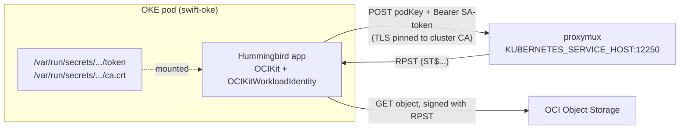

# swift-oke

A small [Hummingbird](https://github.com/hummingbird-project/hummingbird) REST service that reads a file from **OCI Object Storage** and returns its text — authenticating with **OKE Workload Identity**. It runs as a pod in an Oracle Container Engine for Kubernetes (OKE) cluster and uses **no API key and no config file**: the pod's Kubernetes service account *is* the identity, authorized by a condition-based OCI IAM policy.

## What it demonstrates

- **OKE Workload Identity** end-to-end with [`OCIKit`](https://github.com/iliasaz/oci-swift-sdk): `OKEWorkloadIdentitySigner.fromWorkloadIdentity()` exchanges the pod's projected service-account token for a resource principal session token (RPST) at the in-cluster *proxymux* endpoint, then signs Object Storage requests with it.
- **In-process custom-CA TLS**, the way the Java/Python/Go SDKs do it. The proxymux TLS certificate is signed by the in-cluster Kubernetes CA (not a public CA). The opt-in `OCIKitWorkloadIdentity` product pins that CA **in-process** via AsyncHTTPClient + NIOSSL (BoringSSL) — so there is **no `update-ca-certificates` step, no cluster CA install, nothing extra in the image**. It just reads the CA that Kubernetes already projects into every pod.

## Architecture



## Authentication flow

1. `OKEWorkloadIdentitySigner.fromWorkloadIdentity()` reads `KUBERNETES_SERVICE_HOST` and the auto-mounted service-account token + cluster CA.
2. It generates an ephemeral RSA key and `POST`s the public key (`podKey`) to `https://$KUBERNETES_SERVICE_HOST:12250/resourcePrincipalSessionTokens`, authenticated with the SA bearer token, **verifying the proxymux TLS cert against the cluster CA in-process**.
3. The proxymux returns an RPST; the signer signs OCI requests with `keyId = ST$<rpst>` and the ephemeral key, refreshing at the token's half-life.

```swift
import OCIKit
import OCIKitWorkloadIdentity

let signer = try await OKEWorkloadIdentitySigner.fromWorkloadIdentity()
let client = try ObjectStorageClient(region: region, signer: signer)
let data = try await client.getObject(
  namespaceName: ns, bucketName: "bucket-relay-bucket", objectName: "swift-oke-test.txt")
```

## REST API

| Method | Path            | Description                                        |
| ------ | --------------- | -------------------------------------------------- |
| GET    | `/health`       | Liveness (no OCI call).                            |
| GET    | `/`             | Service info.                                      |
| GET    | `/file`         | Read `OCI_OBJECT` (default `swift-oke-test.txt`).  |
| GET    | `/files/{name}` | Read any object in the bucket, returned as text.   |

Configuration (env, all optional): `OCI_BUCKET` (default `bucket-relay-bucket`), `OCI_OBJECT` (default `swift-oke-test.txt`), `OCI_REGION` (falls back to `OCI_RESOURCE_PRINCIPAL_REGION`), `OCI_NAMESPACE` (auto-detected if unset), `PORT` (default `8080`).

## Prerequisites (OCI side, one-time)

1. **Enhanced OKE cluster.** Workload identity requires an enhanced cluster (a non-enhanced cluster returns HTTP 403 "please ensure the cluster type is enhanced").
2. **A bucket + the test object.** In `bucket-relay-bucket`, upload an object named `swift-oke-test.txt` with some text (e.g. `Hello from OKE Workload Identity!`).
3. **An IAM policy** authorizing the workload. OKE Workload Identity does **not** use dynamic groups — you grant access with a **condition-based `any-user` policy** that matches the pod's `request.principal.*` attributes ([Oracle docs](https://docs.oracle.com/en-us/iaas/Content/ContEng/Tasks/contenggrantingworkloadaccesstoresources.htm)). Create it with the OCI CLI (replace the `<...>` placeholders — `BUCKET_COMPARTMENT` is the compartment holding the bucket, `CLUSTER_OCID` your cluster's OCID):

   ```bash
   oci iam policy create \
     --compartment-id <BUCKET_COMPARTMENT_OCID> \
     --name swift-oke-policy \
     --description "Allow the swift-oke workload to read bucket-relay-bucket" \
     --statements '[
       "Allow any-user to read objects in compartment id <BUCKET_COMPARTMENT_OCID> where all {request.principal.type = '\''workload'\'', request.principal.namespace = '\''default'\'', request.principal.service_account = '\''swift-oke'\'', request.principal.cluster_id = '\''<CLUSTER_OCID>'\'', target.bucket.name = '\''bucket-relay-bucket'\''}",
       "Allow any-user to read buckets in compartment id <BUCKET_COMPARTMENT_OCID> where all {request.principal.type = '\''workload'\'', request.principal.namespace = '\''default'\'', request.principal.service_account = '\''swift-oke'\'', request.principal.cluster_id = '\''<CLUSTER_OCID>'\''}"
     ]'
   ```

   Handy lookups: the bucket's compartment — `oci os bucket get --name bucket-relay-bucket --namespace <ns>` (or Console); your cluster's OCID — `oci ce cluster list --compartment-id <c>`.

> The condition attributes (`namespace`, `service_account`, `cluster_id`) must match the pod: namespace `default`, service account `swift-oke`, and your cluster's OCID.

## Build & push the image

The `Dockerfile` builds from the SDK as a **remote** dependency, so the container build can fetch it. Before building, point `Package.swift` at the pushed SDK (the checked-in default is a local path for development):

```swift
// Package.swift
.package(url: "https://github.com/iliasaz/oci-swift-sdk.git", branch: "main"),
```

Then build for your node-pool architecture and push to OCIR:

```bash
cd swift-oke
REGISTRY=<region-key>.ocir.io/<tenancy-namespace>   # e.g. fra.ocir.io/mytenancynamespace
docker build --platform linux/arm64 -t "$REGISTRY/swift-oke:latest" .   # or linux/amd64
docker login <region-key>.ocir.io                                       # user: <tenancy-namespace>/<user>, pass: auth token
docker push "$REGISTRY/swift-oke:latest"
```

## Deploy

Edit `deploy/swift-oke.yaml` — set the `image`, `OCI_REGION`, and (if your bucket differs) `OCI_BUCKET`/`OCI_OBJECT` — then:

```bash
kubectl apply -f deploy/swift-oke.yaml
kubectl rollout status deploy/swift-oke
```

## Expose it (public URL)

The manifest's Service is `ClusterIP` (internal only) by default. To get a **public URL**, expose it through an OCI Load Balancer — either set `type: LoadBalancer` in the manifest, or patch the running Service:

```bash
kubectl patch svc swift-oke -p '{"spec":{"type":"LoadBalancer"}}'
kubectl get svc swift-oke -w   # wait for EXTERNAL-IP to change from <pending> to a public IP
```

This provisions a load balancer with **its own public IP** — distinct from the cluster's API-server endpoint (`:6443`), which never routes to your workloads — and it incurs cost. Revert with `kubectl patch svc swift-oke -p '{"spec":{"type":"ClusterIP"}}'`.

> ⚠️ **Virtual Nodes:** the default `type: LoadBalancer` registers *worker nodes* as backends (via a NodePort). On a **Virtual-Nodes-only** cluster there are no such nodes, so the LB comes up with no backends (`Warning ... There are no available nodes for LoadBalancer`) and returns empty replies. To expose a service publicly on virtual nodes, either add a managed/self-managed **worker node pool**, or use the **OCI Native Ingress Controller** (which targets pod IPs directly). Otherwise, test from inside the cluster (below).

## Test it

Once the Service has an `EXTERNAL-IP`:

```bash
LB=<external-ip>
curl http://$LB/health                       # -> ok
curl http://$LB/file                         # -> the text content of swift-oke-test.txt
curl http://$LB/files/some-other-object.txt
```

If `/file` returns the file's text, the pod authenticated to Object Storage purely through its Kubernetes identity — no keys, no config.

> **OKE Virtual Nodes:** `kubectl port-forward` and `kubectl exec` return `501 not implemented`, so test via the LoadBalancer above, or from inside the cluster — a one-shot curl `Job` hitting the ClusterIP `http://swift-oke.default.svc.cluster.local`, read back with `kubectl logs`. (`kubectl logs` works on virtual nodes; `port-forward`/`exec` do not.)

## Notes

- ⚠️ **SDK dependency:** the checked-in `Package.swift` uses a local `path:` reference for developing against an unmerged SDK branch. Switch it to the remote `branch: "main"` (or a tagged release) before `docker build` — the sibling SDK checkout is not in the image build context.
- The workload-identity transport lives in the **opt-in** `OCIKitWorkloadIdentity` product. Consumers who don't use OKE never pull the swift-nio dependency graph.
- Region is read from `OCI_REGION`, falling back to the resource-principal region (`OCI_RESOURCE_PRINCIPAL_REGION`) if the deployment sets it; the namespace is auto-detected via `getNamespace()`.
